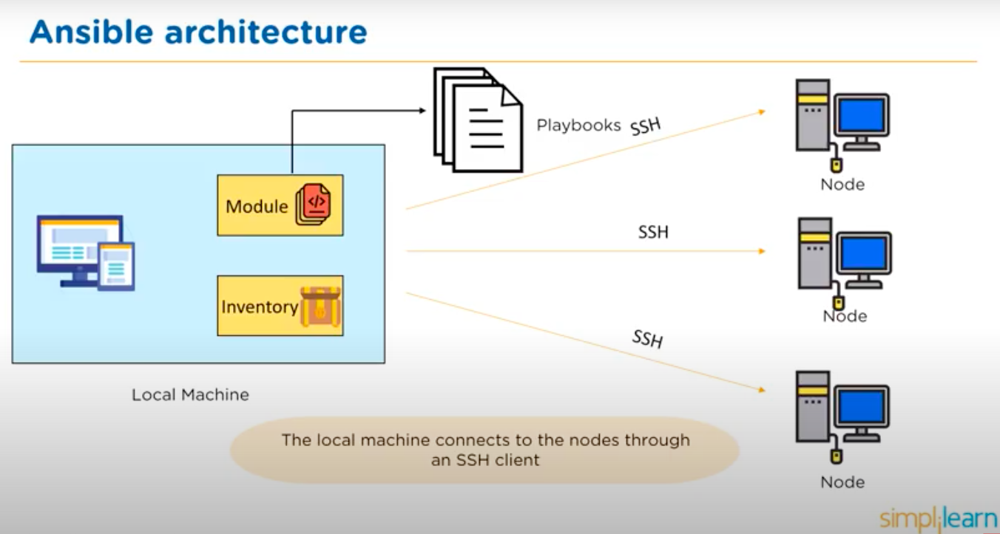

# Ansible
## What is Ansible?
* Automation engine
* Automates cloud provisioning, configuration management, app deployment and more.
* Uses YAML syntax
* Requires Python on Linux hosts and PowerShell 3 on Windows hosts.
* Push Configuration Tool - Doesn't require an agent to be installed on the host. The server pushes the configuration to the nodes. (Chef and Puppet are opposite, they use the pull configuration)

### Platform Agnostic
* With the Ansible abstraction layer, can run code in any environment for any OS and it will know how to perform the operation.
* For example, the following OS's use:
   * Ubuntu - `apt` or `apt-get`
   * CentOS - `dnf` or `yum`
   * IOS - `brew`

## Ansible Architecture?

* Local Machine - This is where Ansible is installed
  * Module - Collection of configuration code files i.e. playbooks
  * Inventory - Document which groups nodes under specific labels
* Nodes - The systems to be configured. Controlled by the local machine
* Local Machine connects to nodes using SSH client

## Testing Strategies
* If you use Ansible language in your playbook (not bash), then it will automatically install/configure and then test if the specified actions has been completed. If the action fails, test will notify you of this.

## How does Ansible provision one machine?
* Uses Playbooks specify the desired structure of an environment.
* Playbooks:
  * Set of instructions to configure nodes
  * Written in YAML - language used to describe data
  * List of plays
* Example:
```YAML
#start of script denoted by ---
---
  # We have 2 plays, play 1 and play 2
  -name: play 1
  # Host is the target for play
  hosts: webserver # webserver is target for play 1
  # Define tasks we want to carry out
  tasks:
    -name: install apache
    yum:
      name: apache
      state: present
    -name: start apache
    service:
      name: apache
      state: start
  -name: play 2
  hosts: databaseserver  # db server is target for play 2
  tasks:
    -name: install MySQL
    yum:
      name: MySQL
      state: present
```
* Where does the host come from? We use inventory
* Inventory file classifies nodes i.e
```
[webserver]
web1.machine
web2.machine
web3.machine

[databaseserver]
db1.machine

```

# Setting Up
## Instances
1. Create an Instance for the Controller. Configure the Security Groups to allow SSH from your ip address.
2. Create an Instance for the Host. Configure the SG to accept SSH traffic from the Controller SG i.e. allows incoming traffic from the controller instance.
3. Connect to the Controller Instance.
4. Install Ansible
```bash
sudo apt update
sudo apt install software-properties-common
sudo apt-add-repository --yes --update ppa:ansible/ansible
sudo apt install ansible
```
5. Check Ansible has been installed
```

4. Copy the ssh access key into the controller virtual machine
```bash
scp -i key_name key_name ubuntu@db_ip:~/.ssh/
```


## Host file
* Here you specify how to connect to a host with an inventory
```
[host_a]
host_private_ip ansible_connection=ssh ansible_ssh_private_key_file=/home/ubuntu/.ssh/key_name.pem
```
* Run the following command to check if the machines are communicating
```
ansible host_a -m ping
```
* If we have muliple hosts, we can ping them automatically
```bash
ansible all -m ping
```
### Additional Commands
* View host machine details
```bash
ansible all -a "uname -a"
```
* View date created
```bash
ansible all -a "date"
```
* View memory used and available of a specific host or all hosts.
```bash
ansible host_a -a "free -m"
ansible all -a "free -m"
```
* Install/update on a specific host
```
ansible host_a -a "apt-get upgrade" --become
```

### Ad-Hoc Commands
* Typically used for infrequent commands e.g. power off all machines during holidays.
* Used to reboot servers, copy files, manage packages and users etc.
#### Tasks
1. Check the uptime of the machine
```bash
ansible host_a -a uptime
```
2. Find the Ansible terminology to update and upgrading all packages
```bash
ansible host_a -m apt -a "upgrade=yes" --become
```


## Writing a playbook
* YAML Playbook starts with 3 dashes (---)
* Playbooks consist of plays
* We can define a name
* Each task should be specific
* One playbook can have many tasks
* **Be mindful of indentation**
### Steps:
1. Run an upgrade
```yaml
ansible host_a -m apt -a "upgrade=yes update_cache=yes" --become
```
2. Create a directory for playbooks `~/playbooks` and in here create a .yaml file with the following commands.

```yaml
---
- name: play 1
  # Host is what we will target, in this case, host_a  
  hosts: host_a
  # Gather facts/state of machine before running playbook
  gather_facts: yes
  # Become grants root permissions to perform tasks which may require root access
  become: true

  tasks:
  - name: Trying to install SQL DB
    # Specify actions
    apt: pkg=mysql-server state=present
```
